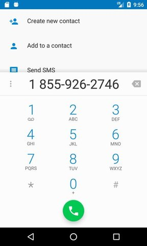

# Phoneword translator built with Xamarin
Xamarin cross-platform app which allows to translate phone number from alphanumeric text into a regular numeric phone number and make phone calls.

## Getting started:
Clone this repository: `git clone https://github.com/technoboom/xamarin-phoneword-translator`.

Open the solution in Visual Studio 2017. 
Build an application. 

Note: In case if you are using Mac OS you can also build iOS version of the app.

## Features:
- [x] Translation from alphanumeric text into a regular numeric phone number
- [x] UI for translation and making calls
- [x] Phone calls

## Screenshots:

## Resources:

1. “Microsoft: DEV215x Introduction to Xamarin.Forms” course: https://courses.edx.org/courses/course-v1:Microsoft+DEV215x+3T2017/course/
2. Xamarin Developer Api: https://developer.xamarin.com/api/